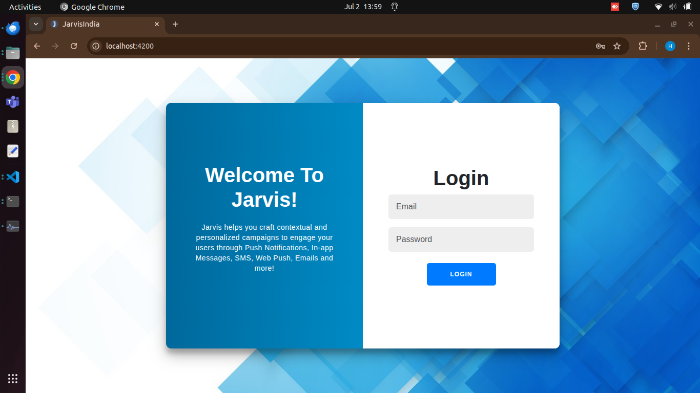
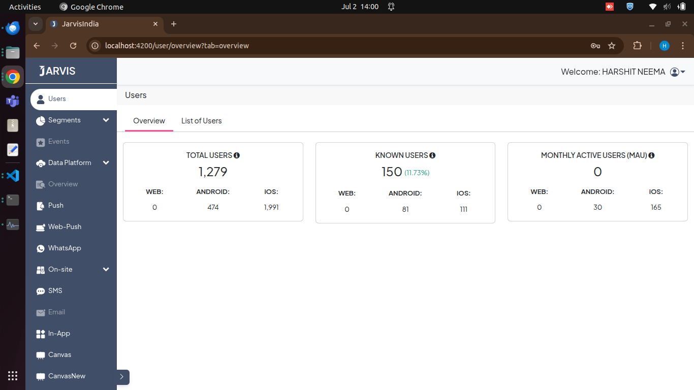
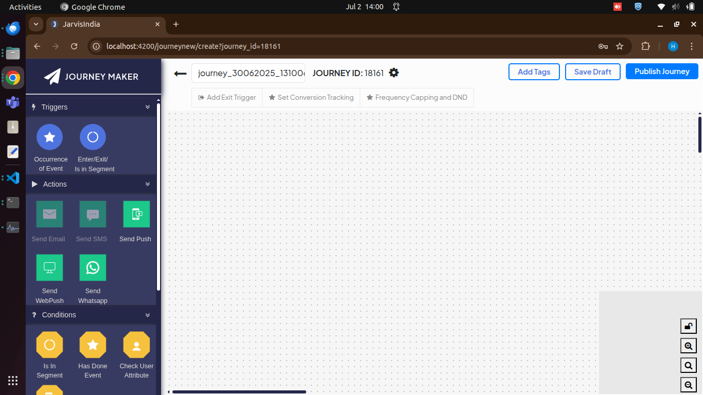

# Getting Started: Your Journey

---

## Step 1: Login to Your Dashboard

Visit the login page and enter your credentials.

---

## Step 2: Navigate to Projects

Click on the 'Projects' tab in the main menu.

---

## Step 3: Create a New Project

Click the 'New Project' button and fill out the form.

---

<!-- Add more steps as needed -->

